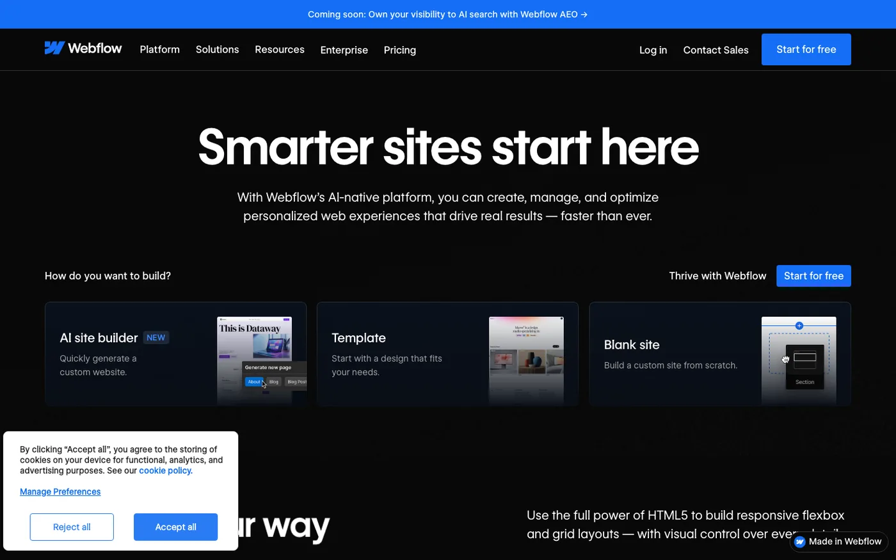
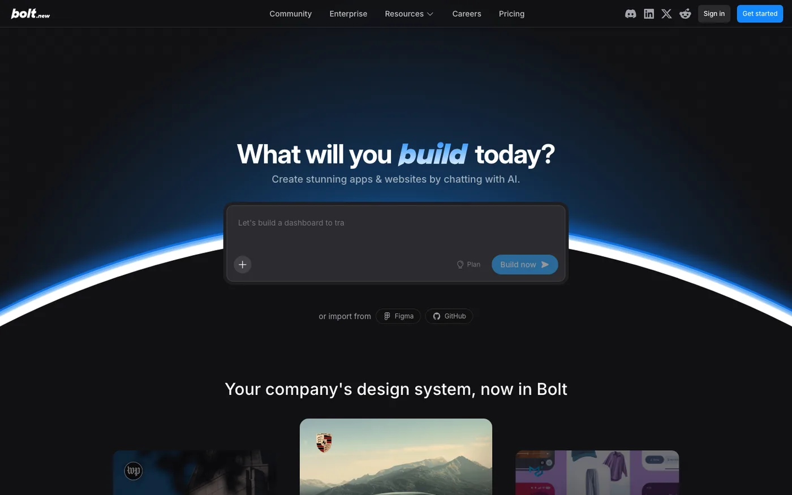

# Different Ways to Build a Website in 2026

Building a website in 2026 is not one decision. It is a stack of decisions about who builds it, how fast it must ship, who maintains it, and what happens when traffic or product scope grows.

This guide groups the main approaches teams use today: visual builders, low-code platforms, AI-assisted tools, template marketplaces, component libraries, modern frameworks, hand-written front ends, full-stack backends, headless content APIs, and ecommerce engines. Use it to match a method to your constraints, not to chase a single "best" tool.

---

## How to read this guide

| Dimension | What to ask |
| --- | --- |
| Speed | Do you need a live URL this week or a product you can evolve for years? |
| Flexibility | How much custom logic, design, and integration do you need? |
| Ownership | Who will update content, fix bugs, and pay for hosting? |
| Scale | Will you outgrow page limits, plugin weight, or serverless cold starts? |
| Cost | Is the bill subscription-based, usage-based, or mostly engineering time? |

The sections below go deep on each category. A comparison table and FAQ sit at the end for snippet-friendly search intent around **how to build a website**, **website development methods**, **no-code vs coding**, and **AI website builders**.

---

## No-code website builders

No-code builders target founders, marketers, and small businesses that want a polished site without writing application code. You design in a visual canvas, connect forms and analytics, and publish to managed hosting.

### [Wix](https://www.wix.com/)

[Wix](https://www.wix.com/) is one of the largest general-purpose site builders. Its editor, App Market, and built-in business tools (booking, ecommerce add-ons) suit local businesses and solo operators who want everything in one subscription.

**Use cases:** Brochure sites, portfolios, light ecommerce, landing pages with fast turnaround.

**Pros**

- Huge template library and beginner-friendly onboarding
- Managed hosting and domains in one place
- Many third-party widgets without coding

**Cons**

- Deep layout or logic customization can feel constrained
- Performance and markup control are limited compared with coded sites
- Migrating away later takes planning

### [Webflow](https://webflow.com/)

[Webflow](https://webflow.com/) sits between pure no-code and professional design systems. Designers get pixel-level control, CMS collections, and clean export options while still avoiding traditional app code for many marketing sites.

**Use cases:** Marketing sites, design-agency deliverables, content-driven landing pages with strong visual craft.

**Pros**

- Designer-grade layout and interactions
- Built-in CMS for structured marketing content
- Strong community and template ecosystem

**Cons**

- Learning curve steeper than drag-and-drop-only tools
- Complex app logic still needs custom code elsewhere
- Pricing scales with CMS items and traffic tiers

### [Framer](https://www.framer.com/)

[Framer](https://www.framer.com/) started in the prototyping world and now ships production sites with animation-first layouts. Teams that care about motion and editorial presentation often pick it for launch pages and product marketing.

**Use cases:** Startup launch pages, interactive storytelling, design-led brand sites.

**Pros**

- Excellent motion and scroll-driven layouts
- Fast iteration for visually rich pages
- Familiar canvas for product designers

**Cons**

- Less suited to large content catalogs without careful structure
- Advanced data workflows may need external tools
- Team workflows differ from classic dev handoff

### [Squarespace](https://www.squarespace.com/)

[Squarespace](https://www.squarespace.com/) focuses on templates, commerce, and content creators. It is a strong default when the site is mostly brand, gallery, or small-catalog selling.

**Use cases:** Creators, restaurants, studios, simple online stores.

**Pros**

- Cohesive templates and typography out of the box
- Integrated scheduling, donations, and commerce on many plans
- Low operational overhead

**Cons**

- Extension model is narrower than open-source stacks
- Custom application features are limited
- Developers rarely standardize on it for complex products

### [Shopify](https://www.shopify.com/) (storefront layer)

[Shopify](https://www.shopify.com/) is ecommerce-first. The Online Store theme system and checkout are the product; the "website" is often a storefront with catalog, cart, and payments already solved.

**Use cases:** DTC brands, regional retail going online, merchants who need payments and inventory on day one.

**Pros**

- Payments, tax, and fulfillment integrations are mature
- Large app ecosystem for shipping, loyalty, and marketing
- Hydrogen and headless options exist for advanced teams

**Cons**

- Non-commerce pages still live inside a commerce-centric model
- Transaction and app fees add up
- Heavy customization may require Liquid or headless architecture

> **Callout:** No-code is not "no work." It trades engineering time for configuration time, content governance, and vendor dependency.

---

## Low-code platforms

Low-code tools add logic, data models, and integrations behind visual builders. They fit internal tools, MVPs (Minimum Viable Products), and vertical apps where speed beats pixel-perfect marketing craft.

### [WordPress](https://wordpress.org/)

[WordPress](https://wordpress.org/) powers a large share of the public web through themes and plugins. With managed hosts and page builders, it behaves like low-code for content sites; with custom themes and plugins, it behaves like a PHP application platform.

**When teams use it:** Blogs, content businesses, WooCommerce stores, agencies delivering repeatable client sites.

**Plugin ecosystem:** SEO plugins, forms, caching, membership, ecommerce, and hundreds of vertical extensions. The risk is plugin overlap, security updates, and performance debt if stacks grow unchecked.

**Extensibility:** Child themes, custom post types, REST API, and headless front ends via [Next.js](https://nextjs.org/) or [Astro](https://astro.build/) when you outgrow the monolith theme layer.

### [Bubble](https://bubble.io/)

[Bubble](https://bubble.io/) is a visual full-stack builder for web apps. You define data types, workflows, and responsive UI without deploying servers yourself.

**When teams use it:** Internal dashboards, marketplace prototypes, tools that need auth and CRUD (Create, Read, Update, Delete) fast.

**Extensibility:** API connectors and plugins; escape hatches exist but complex logic can become hard to test and version.

### [Retool](https://retool.com/)

[Retool](https://retool.com/) targets operators and engineers building admin panels on top of databases and APIs. It is low-code for back-office software, not consumer marketing sites.

**When teams use it:** Support tools, ops consoles, one-off data workflows.

**Extensibility:** JavaScript in queries and components, SSO (Single Sign-On), and tight database connectors.

### [OutSystems](https://www.outsystems.com/)

[OutSystems](https://www.outsystems.com/) serves enterprise teams that need governance, deployment pipelines, and mobile-ready apps from one platform.

**When teams use it:** Regulated industries, large IT departments standardizing delivery.

**Extensibility:** Integration with existing enterprise systems; professional services often part of rollout.

| Approach | Best for | Watch out for |
| --- | --- | --- |
| WordPress | Content + plugins + agencies | Plugin sprawl, security patching |
| Bubble | App-like MVPs without devops | Logic complexity in visual workflows |
| Retool | Internal tools on live data | Not a public marketing site stack |
| OutSystems | Enterprise SDLC (Software Development Life Cycle) | Licensing and implementation cost |

---

## AI website builders and AI coding tools

AI tools compress the path from intent to interface. Some generate entire layouts from prompts; others assist engineers inside existing repos.

### Prompt-to-app builders

| Tool | Role |
| --- | --- |
| [Vercel v0](https://v0.dev/) | UI generation aligned with [React](https://react.dev/) and [Tailwind CSS](https://tailwindcss.com/) patterns |
| [Bolt.new](https://bolt.new/) | In-browser full-stack prototyping with deploy hooks |
| [Base44](https://base44.com/) | AI-native app generation for non-developers |
| [Lovable](https://lovable.dev/) | Product-style generation with iteration loops |

**Typical workflow**

1. Describe the product screen or flow in natural language.
2. Review generated layout, components, and stubbed data.
3. Iterate with follow-up prompts or export to a Git repository.
4. Harden auth, validation, tests, and observability before production.

**Strengths:** Rapid prototyping, stakeholder demos, exploration of layout options.

**Limitations:** Generated code may not match your design system, accessibility bar, or security model. You still own reviews, environment variables, and production operations.

### AI inside the developer workflow

| Tool | Role |
| --- | --- |
| [Cursor](https://cursor.com/) | IDE (Integrated Development Environment) with codebase-aware edits |
| [GitHub Copilot](https://github.com/features/copilot) | Inline completion and chat across editors |

These tools shine when a repo, design tokens, and architecture already exist. They speed refactors, tests, and boilerplate. They do not replace product decisions or production checklists.

> **Callout:** Treat AI output as a draft branch. Run linting, accessibility checks, and security review like any other contributor.

---

## Template-based coding

Templates buy time by shipping layout, typography, and section patterns upfront. Developers replace content, wire forms, and connect APIs.

| Source | What you get |
| --- | --- |
| [Envato Elements](https://elements.envato.com/) | Subscription access to themes, graphics, and assets |
| [ThemeForest](https://themeforest.net/) | One-off HTML, WordPress, and site templates |
| [Cruip](https://cruip.com/) | Tailwind-friendly marketing sections |
| [Tailwind UI](https://tailwindui.com/) | Official [Tailwind CSS](https://tailwindcss.com/) patterns from the framework team |
| [Flowbite](https://flowbite.com/) | Component library and Figma (design tool) kits on Tailwind |

**Customization workflow**

1. Pick a template close to your information architecture.
2. Strip unused sections and align tokens (color, spacing, type scale).
3. Split static HTML into framework components.
4. Connect CMS or API data and add analytics, SEO metadata, and forms.
5. Run performance passes (image formats, font loading, bundle size).

**Tradeoff:** Speed on day one vs. debt if the template fights your component model later.

---

## Component-based UI development

Component libraries package accessible patterns so teams compose interfaces instead of redrawing buttons and dialogs.

| Library | Notes |
| --- | --- |
| [shadcn/ui](https://ui.shadcn.com/) | Copy-in [React](https://react.dev/) components built on Radix primitives and Tailwind |
| [Aceternity UI](https://ui.aceternity.com/) | Motion-heavy marketing sections |
| [Magic UI](https://magicui.design/) | Animated landing blocks |
| [HyperUI](https://hyperui.dev/) | Free Tailwind snippets |
| [PageDone](https://pagedone.io/) | Curated blocks for fast landing assembly |

**Why teams adopt them**

- Consistent focus states, keyboard support, and density
- Shared vocabulary between design and engineering
- Faster experiments on top of [Next.js](https://nextjs.org/) or [Vite](https://vite.dev/)

**Caveat:** Visual sameness if you never customize tokens. Budget time for brand-specific motion, illustration, and content design.

---

## Modern frameworks

Frameworks structure routing, data loading, and rendering so applications stay maintainable as features grow.

### [React](https://react.dev/)

[React](https://react.dev/) is a component model for UI. It does not prescribe routing or data by itself; meta-frameworks do.

**Rendering:** Client-side rendering (CSR), server-side rendering (SSR), static generation, and streaming depend on the meta-framework you choose.

### [Next.js](https://nextjs.org/)

[Next.js](https://nextjs.org/) is the dominant [React](https://react.dev/) framework for full-stack web apps on [Vercel](https://vercel.com/) and elsewhere. App Router patterns combine layouts, server components, and API routes.

**Scalability:** Strong for SEO-heavy marketing plus authenticated product surfaces in one repo.

### [Vue](https://vuejs.org/)

[Vue](https://vuejs.org/) offers approachable single-file components and a mature ecosystem ([Nuxt](https://nuxt.com/) for SSR and static sites).

**Scalability:** Excellent for teams that prefer progressive adoption from legacy pages.

### [Svelte](https://svelte.dev/)

[Svelte](https://svelte.dev/) shifts work to compile time, producing small bundles. [SvelteKit](https://svelte.dev/docs/kit) handles routing and adapters.

**Scalability:** Strong for performance-sensitive marketing and apps with lean runtime cost.

### [Astro](https://astro.build/)

[Astro](https://astro.build/) ships minimal JavaScript by default and islands hydrated components where needed.

**Scalability:** Ideal for content sites that mix [React](https://react.dev/), [Vue](https://vuejs.org/), or markdown with mostly static HTML.

| Framework | Sweet spot | Rendering highlight |
| --- | --- | --- |
| React + Next.js | Full-stack product + marketing | SSR, streaming, edge deployment |
| Vue + Nuxt | Content + app hybrid | Flexible SSR/static |
| SvelteKit | Lean interactive apps | Compile-time optimization |
| Astro | Content-heavy sites | Islands + markdown |

---

## Traditional web development

Every modern stack still rests on the open web platform.

### [HTML](https://developer.mozilla.org/en-US/docs/Web/HTML)

Semantic HTML improves accessibility, SEO, and maintainability. Landmarks (`header`, `nav`, `main`, `footer`), heading hierarchy, and meaningful links still matter in 2026.

### [CSS](https://developer.mozilla.org/en-US/docs/Web/CSS)

Layout with Flexbox and Grid, container queries, and custom properties cover most product UI. Design systems often compile to utility classes ([Tailwind CSS](https://tailwindcss.com/)) or CSS modules.

### [JavaScript](https://developer.mozilla.org/en-US/docs/Web/JavaScript)

[JavaScript](https://developer.mozilla.org/en-US/docs/Web/JavaScript) (and [TypeScript](https://www.typescriptlang.org/)) powers interactivity, form validation, and client-side data fetching. Even SSR apps ship JS for hydration and progressive enhancement.

**When to stay "traditional":** Microsites, embedded widgets, email-safe fragments, or learning foundations before frameworks.

---

## Full stack architecture

A public website is often the surface of a system that includes APIs (Application Programming Interfaces), databases, authentication, and background jobs.

### Application layer

[Node.js](https://nodejs.org/) remains the default for JavaScript teams building APIs and server components. Other runtimes ([Python](https://www.python.org/), [Go](https://go.dev/), [Rust](https://www.rust-lang.org/)) appear when teams optimize for ML (Machine Learning) services or high-throughput workers.

### Data and auth

| Service | Strength |
| --- | --- |
| [Supabase](https://supabase.com/) | Postgres, auth, storage, realtime, row-level security |
| [Firebase](https://firebase.google.com/) | Mobile-friendly auth, Firestore, fast prototyping |
| [PostgreSQL](https://www.postgresql.org/) | Relational integrity, reporting, extensions |

Authentication patterns include email magic links, OAuth providers, and session cookies with HTTP-only flags. For South African and global products, plan payment and identity providers early ([Paystack](https://paystack.com/), [Stripe](https://stripe.com/), etc.).

### What "full stack" means in practice

- **Marketing site:** static or SSR pages + forms + analytics
- **SaaS (Software as a Service):** auth, billing webhooks, multi-tenant data
- **Marketplace:** listings, search, messaging, payouts, moderation

> **Callout:** Pick boring, well-documented data stores unless you have a clear reason to experiment. Most failed MVPs stall on auth and schema changes, not on framework choice.

---

## Headless CMS and APIs

Headless CMS (Content Management System) products store structured content and deliver it over APIs so any front end can render it.

| Platform | Typical fit |
| --- | --- |
| [Sanity](https://www.sanity.io/) | Real-time collaborative editing, portable text |
| [Contentful](https://www.contentful.com/) | Enterprise content operations |
| [Strapi](https://strapi.io/) | Self-hosted or cloud, developer-controlled schema |

**Benefits**

- Marketers edit without touching Git
- Same content powers web, app, and email
- Preview workflows and localization hooks

**Costs**

- Schema governance and migration discipline
- Webhook and cache invalidation complexity on high-traffic sites

Pair headless content with [Next.js](https://nextjs.org/), [Astro](https://astro.build/), or static generators for programmatic SEO pages at scale.

---

## Ecommerce platforms

Selling online adds catalog, inventory, tax, payments, and fulfillment on top of marketing pages.

### [Shopify](https://www.shopify.com/)

Hosted commerce with themes, apps, and global payments. Best when commerce is the core product and you want operations handled.

### [WooCommerce](https://woocommerce.com/)

[WordPress](https://wordpress.org/) plugin for stores you host yourself. Flexible if you already run WordPress and can manage performance and security.

### [Medusa](https://medusajs.com/)

Open-source commerce modules with a developer-first API. Fits custom storefronts on [Next.js](https://nextjs.org/) when you need ownership of UX and checkout flow.

| Platform | Hosting | Customization | Best for |
| --- | --- | --- | --- |
| Shopify | Managed | Themes + apps + headless | Merchants optimizing time-to-sale |
| WooCommerce | Self or managed WP | Plugins + PHP theme layer | Content + store in one WordPress stack |
| Medusa | Self-hosted API | Full front-end control | Engineering-led commerce UX |

---

## Choosing an approach in 2026

### Master comparison

| Method | Time to first publish | Flexibility | Ongoing cost driver | Scale ceiling |
| --- | --- | --- | --- | --- |
| No-code builders | Days | Low to medium | Subscriptions + apps | Platform limits |
| Low-code platforms | Days to weeks | Medium | Licenses + builders | Workflow complexity |
| AI generators | Hours to days | Medium (with review) | API usage + hosting | Code quality debt |
| Templates + Tailwind | Days to weeks | Medium | Engineering time | Template fit |
| Component libraries | Weeks | High | Engineering time | Team skill |
| Modern frameworks | Weeks to months | Very high | Engineering + infra | Architecture skill |
| Full custom stack | Months | Very high | Engineering + infra | Team and ops maturity |

### Speed vs flexibility vs cost

| Priority | Lean toward |
| --- | --- |
| Fastest brochure or campaign site | [Webflow](https://webflow.com/), [Framer](https://www.framer.com/), or [Wix](https://www.wix.com/) |
| Fastest internal tool | [Retool](https://retool.com/) or [Bubble](https://bubble.io/) |
| Fastest coded MVP with growth path | [Next.js](https://nextjs.org/) + [Supabase](https://supabase.com/) + AI-assisted IDE |
| Long-term product platform | [React](https://react.dev/) ecosystem, typed APIs, tested migrations |
| Content + commerce blog business | [WordPress](https://wordpress.org/) or headless CMS + static front end |

### Scalability comparison

| Signal you are outgrowing the stack | Direction to move |
| --- | --- |
| Marketing site needs custom app features | Headless CMS + [Next.js](https://nextjs.org/) |
| Visual builder cannot model your data | Custom schema + API |
| Plugin conflicts and slow TTFB (Time to First Byte) | Slimmer stack or static generation |
| AI-generated code lacks tests | Engineering standards, CI (Continuous Integration), design system |

---

## Practical workflow for technical teams

Many product teams blend methods:

1. **Prototype** UI with [Vercel v0](https://v0.dev/) or [Bolt.new](https://bolt.new/).
2. **Implement** in [Next.js](https://nextjs.org/) with [shadcn/ui](https://ui.shadcn.com/) and your tokens.
3. **Capture** content in [Sanity](https://www.sanity.io/) or markdown in Git for developer-owned posts.
4. **Deploy** on [Vercel](https://vercel.com/) or similar with preview URLs per pull request.
5. **Measure** Core Web Vitals, conversion, and search performance before scaling content programmatically.

This matches how editorial sites (like technical blogs) stay fast: static or SSR pages, optimized images, structured metadata, and automated pipelines for assets and links.

---

## FAQ

### What is the easiest way to build a website in 2026?

For non-developers, managed no-code tools such as [Wix](https://www.wix.com/) or [Squarespace](https://www.squarespace.com/) are the fastest path to a live domain. For developers, [Next.js](https://nextjs.org/) with a component library and a hosted database is often the best balance of speed and control.

### Is no-code better than coding?

No-code wins on time-to-publish and handoff to non-technical editors. Coding wins on custom logic, performance tuning, and ownership. Many companies use no-code for marketing and coded apps for the product.

### Can AI build a production website for me?

AI can generate layouts, components, and starter backends. Production still needs security review, accessibility testing, analytics, legal pages, and operational monitoring. Treat AI as acceleration, not a substitute for engineering discipline.

### What stack do startups use most often?

A common pattern is [Next.js](https://nextjs.org/) on [Vercel](https://vercel.com/), [Supabase](https://supabase.com/) or [PostgreSQL](https://www.postgresql.org/), [Tailwind CSS](https://tailwindcss.com/), and payments via [Stripe](https://stripe.com/) or regional providers. Content may live in Git, a headless CMS, or both.

### How do I choose between Webflow and a coded site?

Choose [Webflow](https://webflow.com/) when design-led marketing pages dominate and engineering time is scarce. Choose a coded site when you need deep product logic, native apps, or strict performance and testing requirements.

### What is the difference between low-code and no-code?

No-code targets users who will not write code. Low-code adds data models, workflows, and integrations for richer apps, often with optional scripts. [Bubble](https://bubble.io/) and [WordPress](https://wordpress.org/) illustrate the low-code end; [Wix](https://www.wix.com/) illustrates no-code for general sites.

### Do I need a headless CMS?

You need one when non-developers publish often, you ship multiple channels from the same content, or you run programmatic SEO at scale. Small technical blogs can stay in markdown in Git with a static generator.

### Which ecommerce platform is best for developers?

[Medusa](https://medusajs.com/) and headless [Shopify](https://www.shopify.com/) storefronts offer the most front-end freedom. [WooCommerce](https://woocommerce.com/) fits WordPress-centric teams. Hosted [Shopify](https://www.shopify.com/) fits merchants optimizing operations over custom checkout UX.

---

## Summary

There is no single best way to build a website in 2026. No-code and AI tools compress discovery and launch. Low-code and templates cover repeatable patterns. Frameworks and full-stack services carry products that must evolve for years.

Match the method to how much you will customize, who maintains the system, and what happens when requirements change. Then invest in content structure, performance, and clear metadata so your pipeline (images, links, and search) can do the repetitive work while you focus on product truth.

