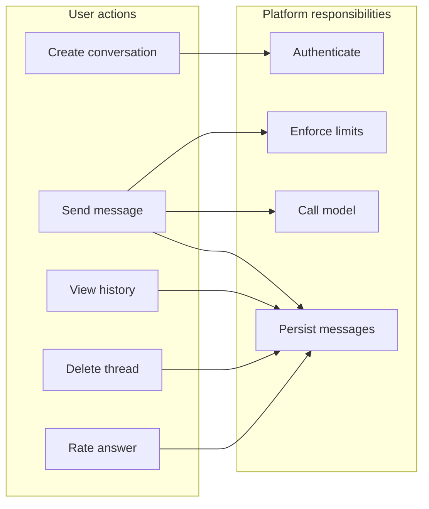
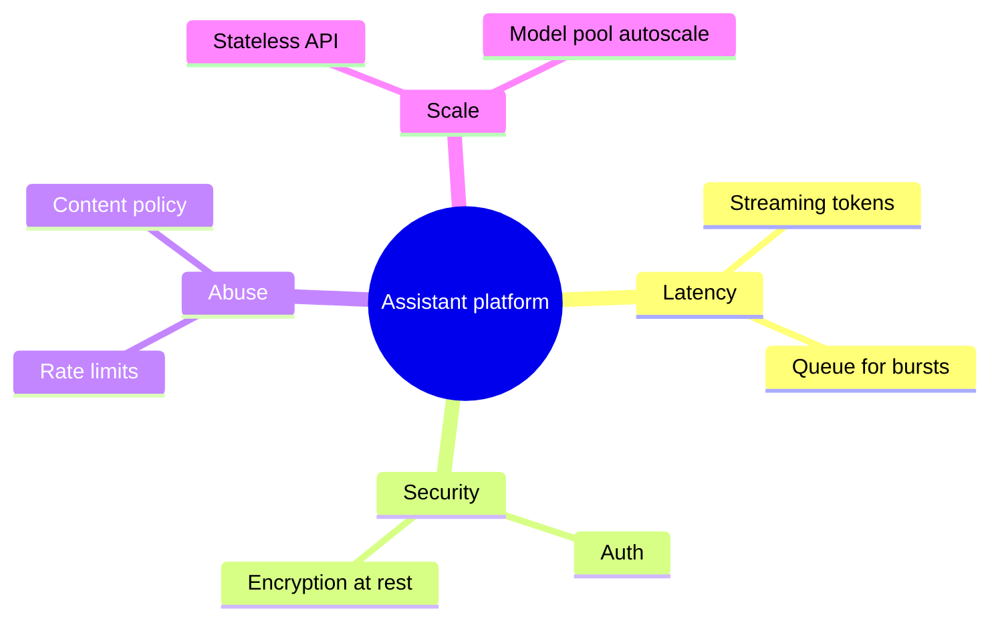
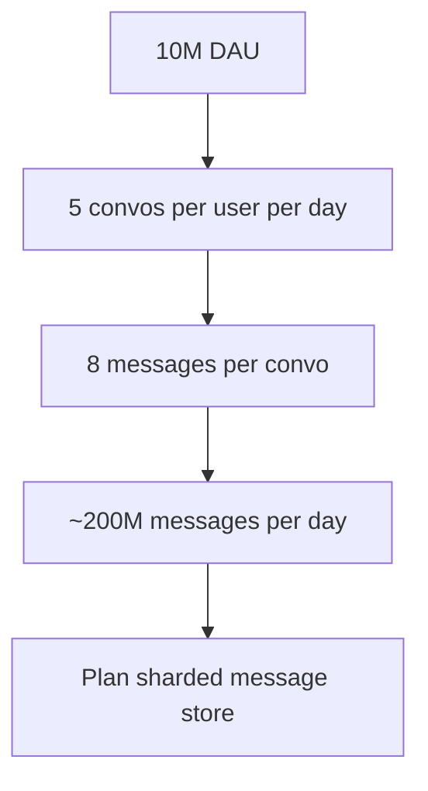
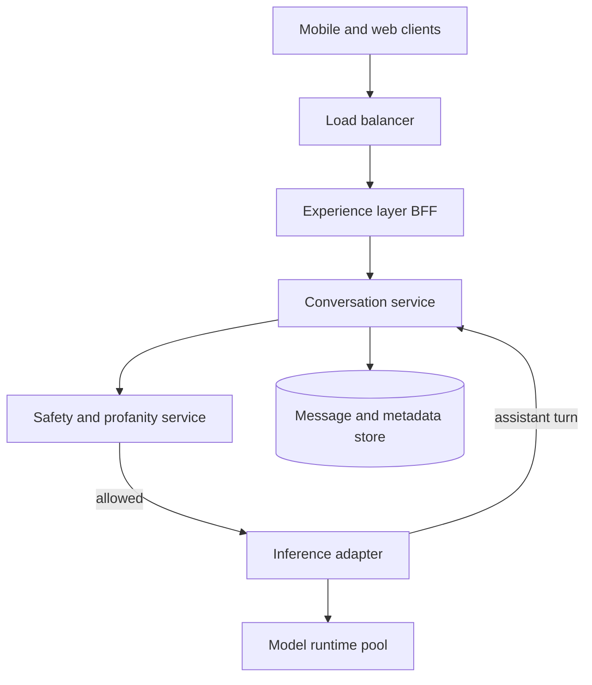
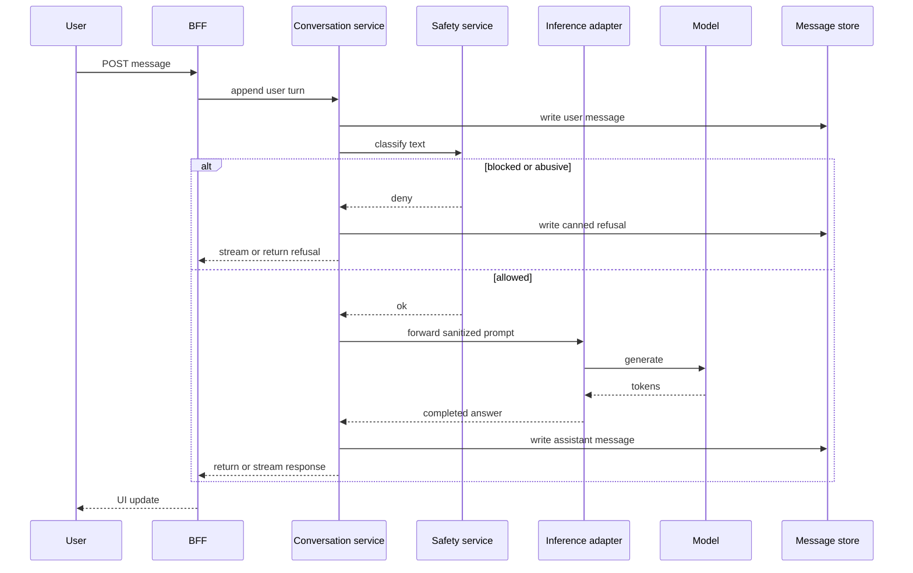
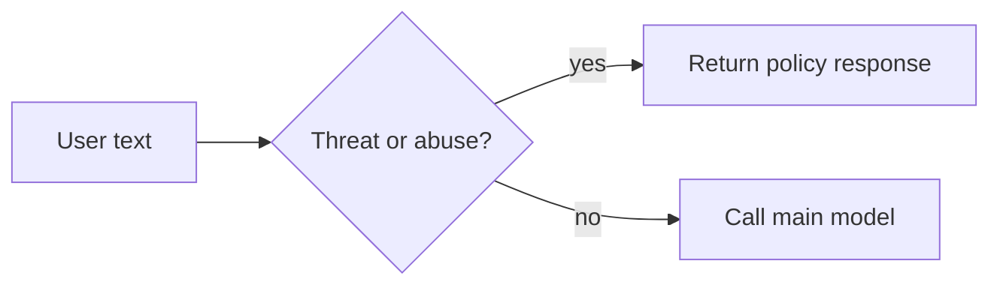
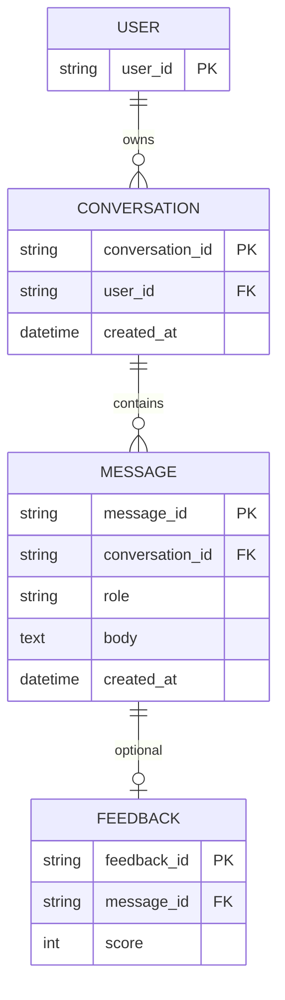
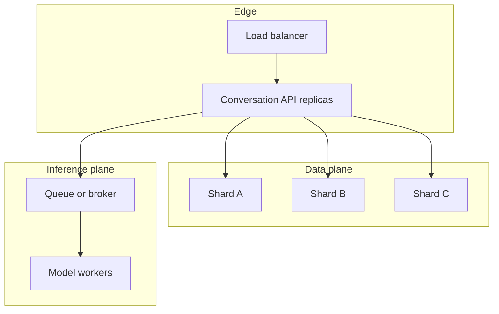

**LLM chat system design** is where teams lose the room in five minutes if they jump to boxes. I open with behavior, numbers, and failure modes, then draw services. Same order every time.

I am [Ayabonga Qwabi](https://www.qwabi.co.za/), AI specialist and cloud architect based in South Africa. If you need this built rather than sketched, [AI integration and cloud work](https://www.qwabi.co.za/solutions/ai-integration-specialist-south-africa) is the lane I ship in.

## What you are designing (text-only slice)

This article sticks to **English text** so token limits, moderation, and latency stay honest.

Users need to:

- start and continue a conversation
- send messages and read model replies
- list, open, and delete threads
- rate answers with thumbs up or down (stored as signals; training pipelines are a later program)

## Non-functional requirements to state out loud

Say these before anyone draws a rectangle:

- Latency: multi-second answers can be acceptable if you explain context size, tools, and streaming.
- Security: identity, authorization, audit trails on stored turns.
- Rate limits: per user, per IP, and per API key so one noisy client cannot starve shared inference.
- Scale: web tier scales separately from the model pool.

## Envelope math for LLM chat system design interviews

When nobody has production metrics, I still put numbers on the board:

- 10M daily active users
- 5 conversations per user per day
- 4 user turns and 4 assistant turns per conversation (8 persisted messages per conversation)

That order of magnitude is **~200M messages per day** on write-heavy paths if you log everything.

At ~100 bytes average metadata per message (text plus ids and timestamps, not big attachments), you are in the tens of GB per day of append traffic. Multi-year retention means **sharded** storage and retention policy, not one hot partition.

## High-level architecture for a chat LLM product

I put a thin **experience layer** (BFF or gateway) in front of mobile and web so auth, versioning, and orchestration stay in one place.

Services I usually draw:

1. Conversation service: threads, list, delete, append turns
2. Safety gate: small classifier or rules plus optional hosted moderation
3. Inference adapter: prompt assembly, tools, caps, routing to the model fleet
4. Durable store: conversation id, role, body, timestamps, model metadata

## Happy-path sequence for one message

## Why moderation runs before the big model

If there is no path to a useful answer, I do not burn GPU. A **cheap** gate (lexicon, small classifier, distilled toxicity model) returns block, allow, or canned reply. Hosted APIs or embedding-plus-linear models are details. Invariant: **cheap path first, expensive model second**.

## Data model I sketch in LLM chat system design reviews

- Conversation has many messages
- Roles: user, assistant, system, tool
- Optional feedback row tied to assistant message id

## Scale levers that interviewers expect you to name

- Stateless BFF and conversation API behind the load balancer
- Async workers if you add summarization or offline eval jobs
- Partition by `user_id` or `conversation_id` hash
- Autoscale the inference fleet on **queue depth**, not only HTTP RPS

## Related system design posts

- [Dating app system design with geo-sharded feeds](/blog/system-design-swipe-dating-platform)
- [Food delivery system design for search, drivers, and checkout](/blog/system-design-food-delivery-core-flows)
- [Cross-platform libraries when the client is not only web](/blog/cross-platform-development-libraries-guide)

## FAQ

**What is LLM chat system design?**  
It is the end-to-end layout for a product where users send text, a model replies, and you persist turns, enforce limits, and gate abuse without melting cost or latency.

**Where does moderation sit?**  
In front of the main model call on the hot path, with a fast classifier or rules layer so toxic or useless traffic never hits the big stack.

**How do you size storage?**  
Start from DAU, conversations per user, messages per conversation, and bytes per row. If growth is real, plan sharding and retention on day one, not after the first outage.

**Do thumbs-down ratings train the model live?**  
Usually no in v1. You store signals, then batch pipelines or human review decide what actually changes weights.

## Close the loop before you leave the room

I re-read the functional and non-functional list and tick boxes. Multimodal input later means object storage, separate moderation models, and higher egress. Say that explicitly so scope does not creep mid-review.

For scope and budget on a real build, use the [interactive quote tool](https://www.qwabi.co.za/get-a-quote) with your traffic and compliance constraints.
