Food delivery system design splits into three pain points that fail independently: search has to feel instant, driver assignment cannot double-book, checkout cannot double-charge.

I draw the same three pillars in design reviews and regional rollout plans. I am [Ayabonga Qwabi](https://www.qwabi.co.za/). For platform builds, [custom software and cloud architecture](https://www.qwabi.co.za/solutions/custom-software-development-company-south-africa) is where I spend most delivery time.

## Scope before boxes

One deep session might cover only:

- search for restaurants and menu items
- driver matching when pickup is ready
- customer payment capture

Menu authoring, kitchen hardware, and full dispatch ops can be parallel programs so the core story stays legible.

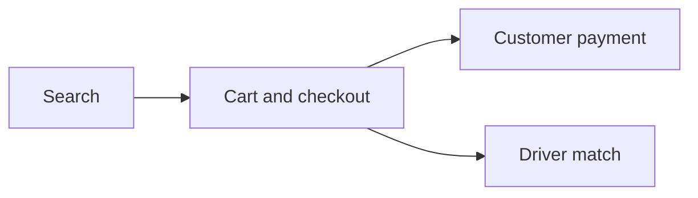

## Non-functional split for food delivery system design

- Search: low latency, high availability, **eventual** catalog mirrors with a written **SLA** on how stale menu text can be
- Driver matching: **stronger consistency** than search. Two drivers on one order is worse than a late special.
- Payments: **strong consistency** and **idempotency** so retries never create duplicate charges

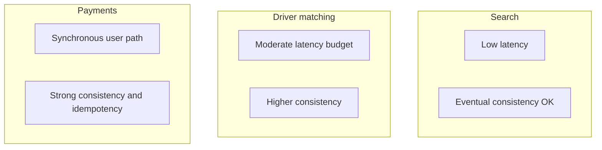

## Macro architecture

I default to **microservices** behind a **gateway or load balancer** so a lunch-hour search spike does not starve checkout, and checkout spikes do not starve driver sockets.

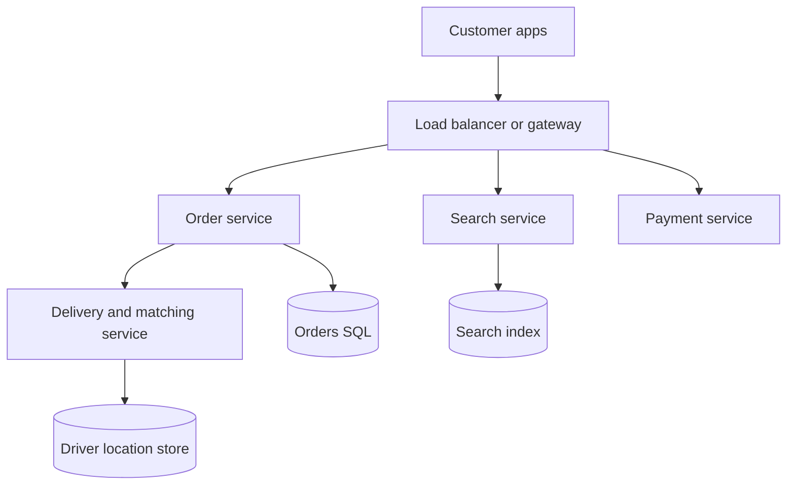

## Search with Elasticsearch or OpenSearch

For restaurant and dish text I reach for **Elasticsearch** or **OpenSearch**: analyzers, ranking, and horizontal growth are first-class.

Catalog changes flow through CDC or an outbox into index workers on a **cadence** you can defend in cost terms. I do not full reindex the planet on every price tweak unless the business truly demands it.

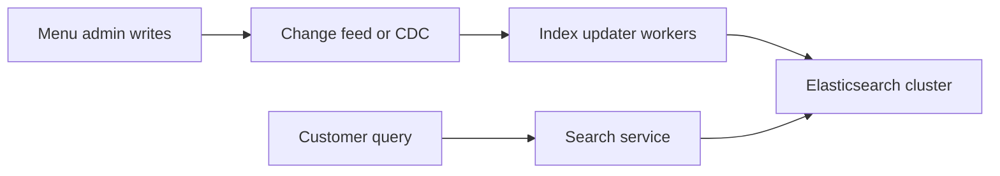

### Search request sequence

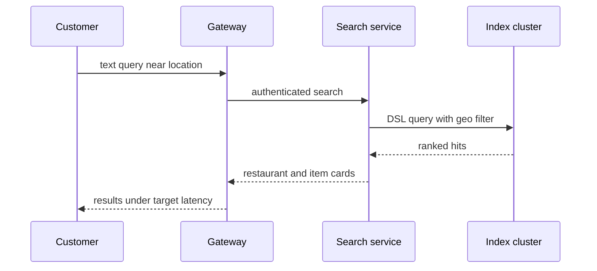

## Driver matching and live location

Drivers on shift need a **session-style** channel, not polling every second. **WebSockets** or an equivalent stream carry presence and assignment events.

Location writes should not fire on every GPS tick. The client can batch until the driver moves a meaningful distance from the last posted point.

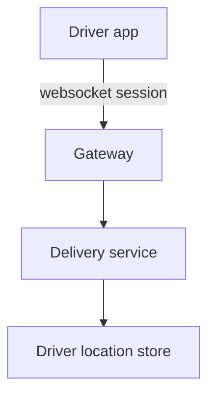

Shard driver locations by **region cells** so a Seattle dispatch query never scans New York rows.

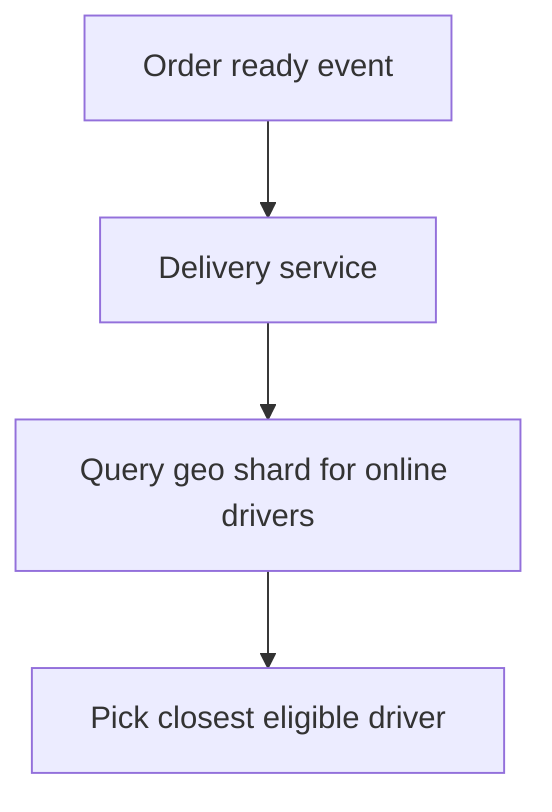

## One driver per active order

Authoritative **order state** lives in SQL or another transactional store. Assignment uses an explicit **order to driver** mapping.

Before assign:

- order still unassigned
- driver online and, if that is the rule, not already carrying another order

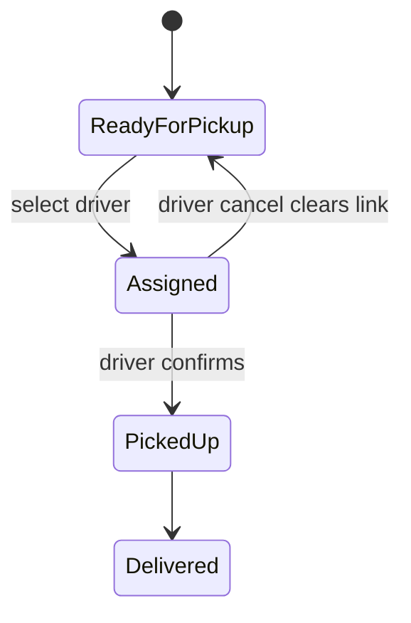

### Order-driver store for point reads

A narrow mapping from order id to driver id keeps the happy path to a **single-point read**. A reverse driver-to-order index can speed other reads if you accept **dual-write** cost.

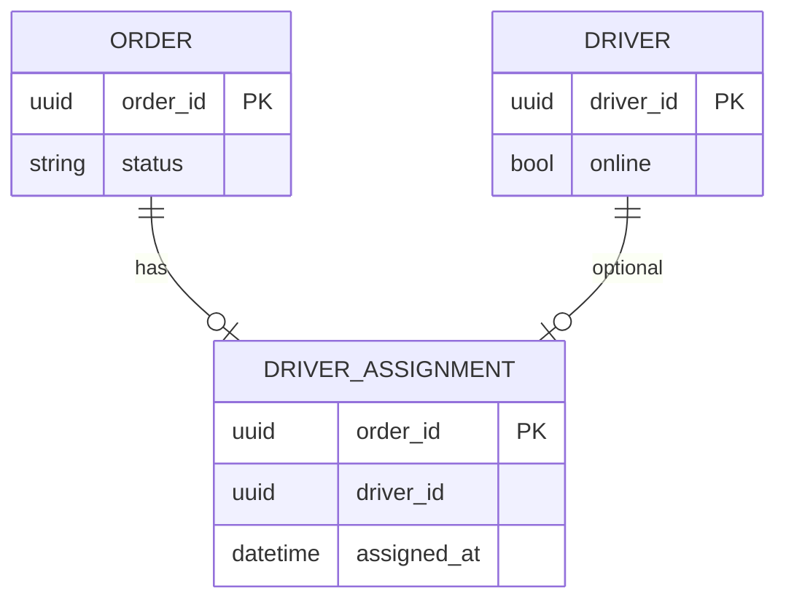

## Payments and idempotency in food delivery system design

From the customer’s view, capture is **synchronous**: you know pass or fail before the kitchen starts.

**Idempotency keys** come from the client (or the edge that wraps the mobile SDK). The payment service remembers keys so a **retry storm** collapses to one charge.

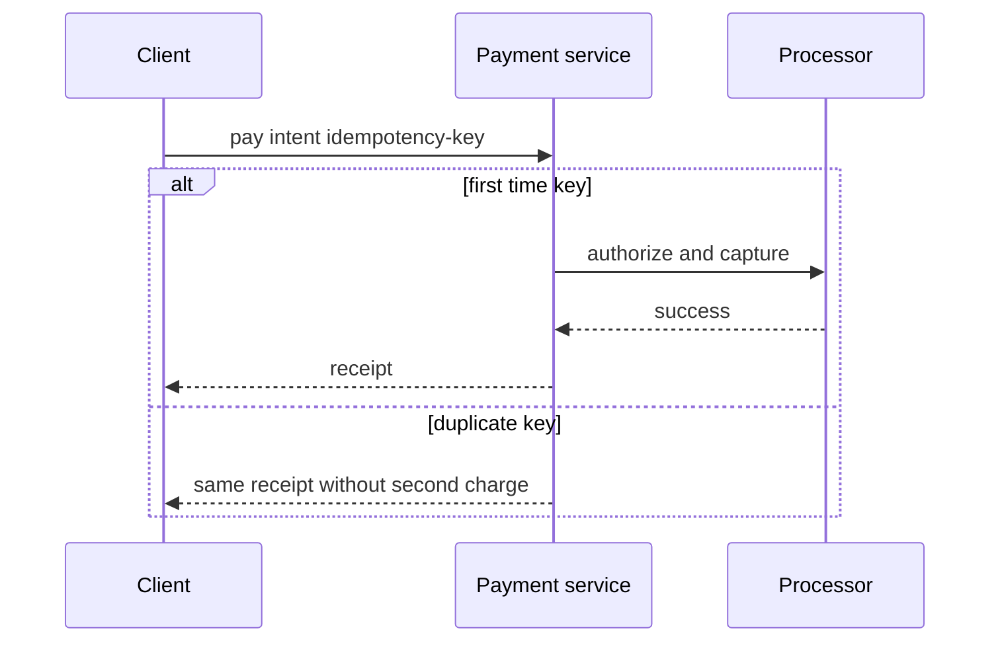

## Slice after checkout

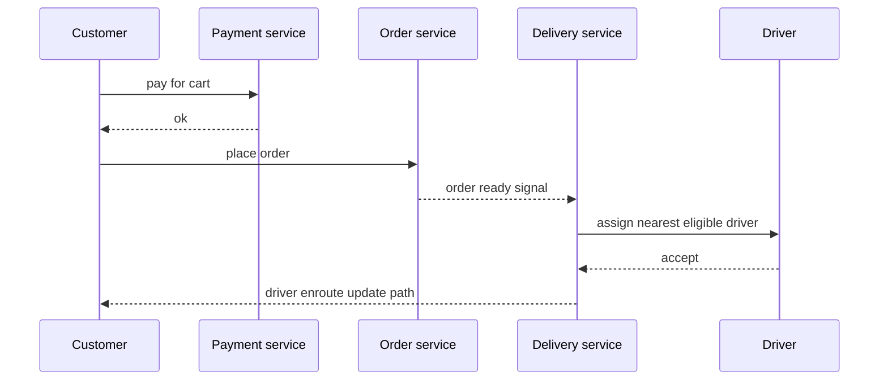

## Regional scale without pretending the world is one city

Even when the product is **US-only**, I still draw **region boundaries** so search clusters, driver stores, and compliance boundaries stay **co-located** with traffic. That stops a design that only works in one metro.

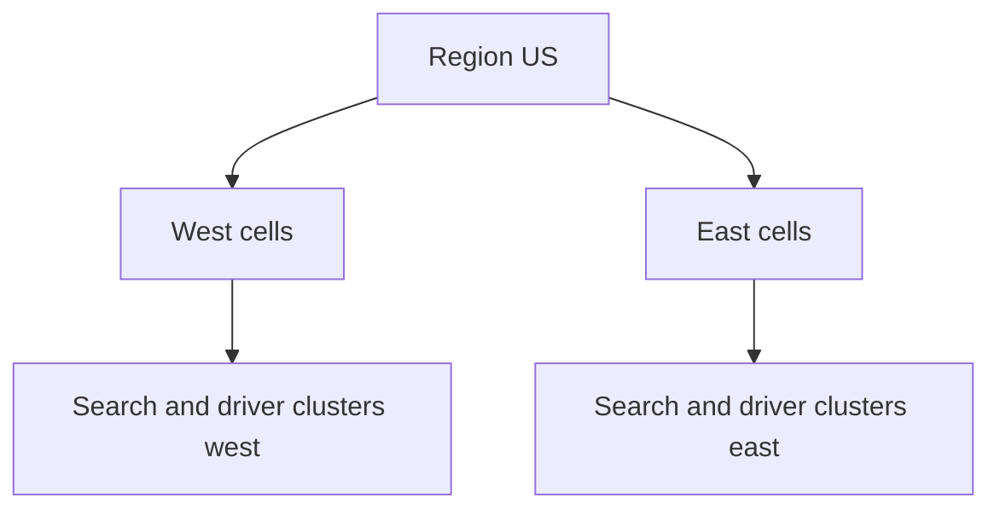

## Review checklist

- Search: latency target plus explicit staleness budget for menus
- Dispatch: race-safe assignment under concurrent matchers
- Payments: idempotent, auditable, reconciled with processor

## Related system design posts

- [LLM chat system design with moderation and sharded stores](/blog/system-design-conversational-ai-assistant)
- [Dating app system design with geo-sharded feeds](/blog/system-design-swipe-dating-platform)

## FAQ

**Why Elasticsearch for food delivery search?**  
Faceted text plus geo filters plus horizontal index shards match how people actually query (dish name, cuisine, distance).

**How do you avoid assigning two drivers to one order?**  
Transactional order state plus an assignment row or equivalent, checked before write. Contention needs a clear retry story.

**Where do idempotency keys live?**  
On the payment attempt from the client or gateway so network retries cannot create duplicate captures.

**Is eventual consistency acceptable for menus?**  
Often yes for read replicas if you publish an SLA (“menu changes visible within N minutes”) and handle out-of-stock at checkout.

Ship plans with numbers: [get a quote](https://www.qwabi.co.za/get-a-quote).
