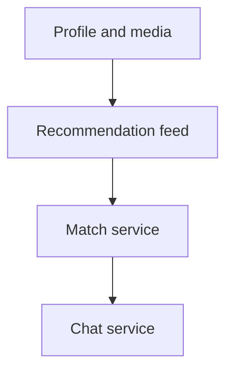
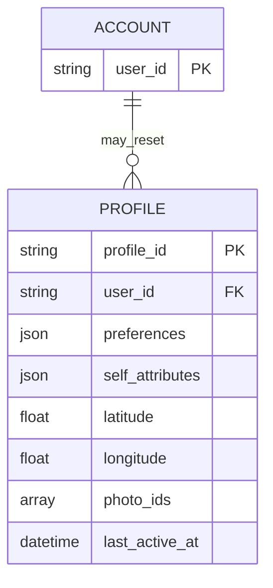
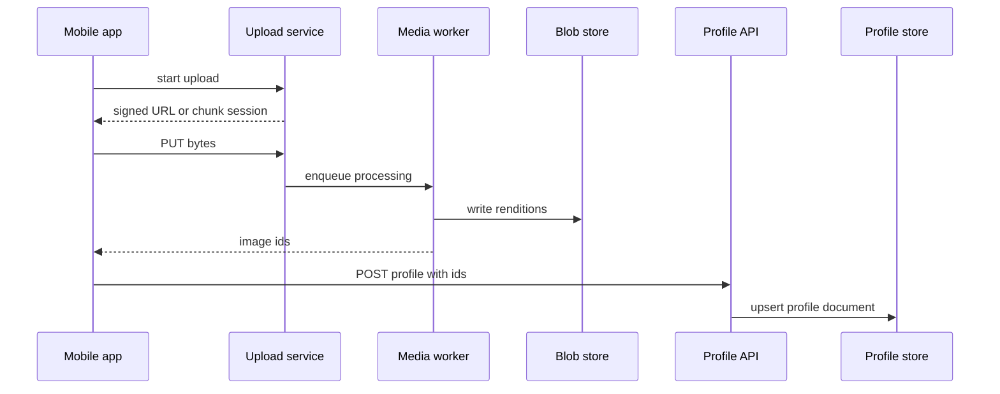
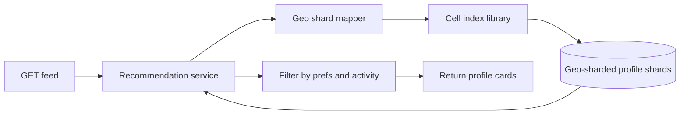
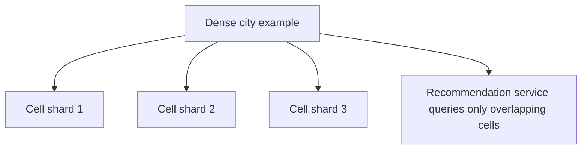
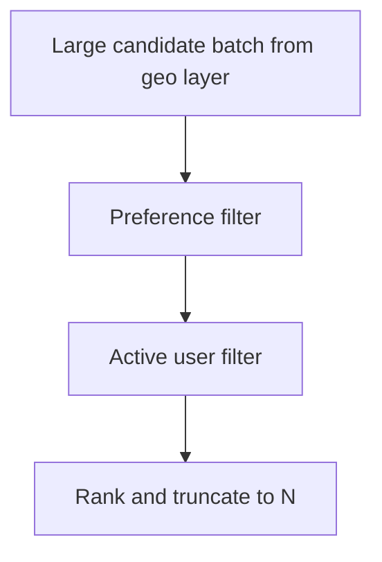
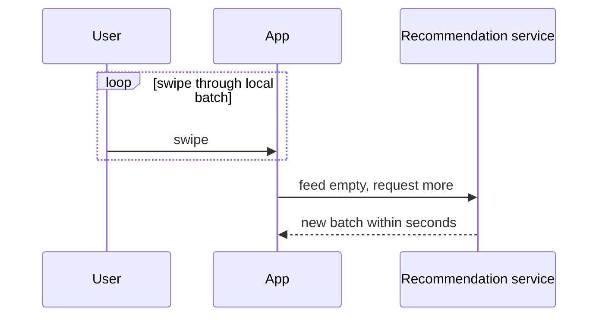
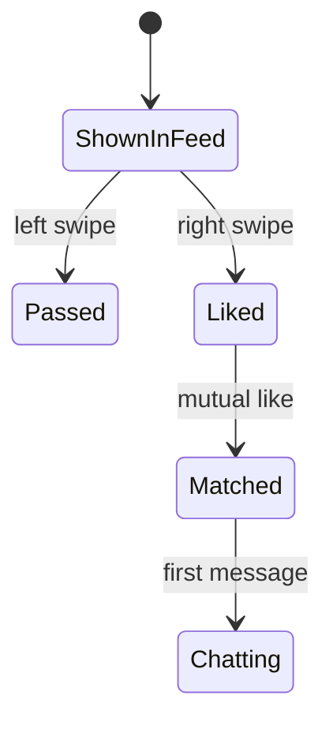
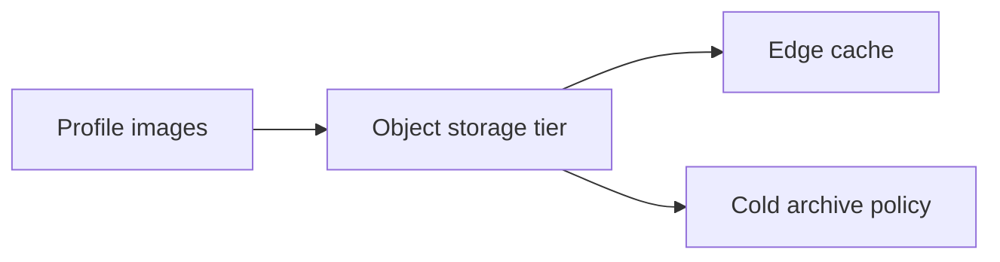

The UI looks like photos and cards. The backend is binary media, JSON-shaped profiles, location, and a recommendation loop that has to stay fast while millions of people swipe.

This is how I break down **dating app system design** in reviews and whiteboard sessions. I am [Ayabonga Qwabi](https://www.qwabi.co.za/). For shipping mobile backends, see [mobile app development in South Africa](https://www.qwabi.co.za/solutions/mobile-app-development-south-africa).

## Core product pillars

- Profile creation: photos, bio, preferences, location
- Feed: ranked candidates near the viewer
- Matching: mutual accept creates a relationship record
- Chat after match (media in a later phase)

## Profile model for dating app system design

I split **user id** (billing and account) from **profile id** so someone can reset their dating identity without deleting purchase history.

A profile document usually holds:

- preferences JSON (index selective fields if you filter on them)
- self-attributes (age band, gender, short bio)
- location (lat, long, coarse region for policy)
- photo ids only after upload completes

## Image pipeline before the profile row

I do not let raw uploads land in the same transaction as profile insert.

1. Client gets signed URLs or streaming session from an upload service
2. Worker transcodes, resizes, runs policy checks
3. Blob store holds canonical renditions
4. Client gets stable image ids
5. Profile API writes the document to a document store (NoSQL fits the shape)

## Recommendation feed and geo locality

Constraints I write on the board first:

- local candidates, not random global rows
- recently active people so the deck feels alive
- capped page size (often ~50 cards) so payloads stay small

### Why geo sharding shows up in dating app system design

With a geospatial cell index (S2-style or equivalent), the service sends the viewer location, reads **only shards that overlap nearby cells**, then filters a bounded set. That is how p95 stays stable when row counts go huge.

## Filters after geo fetch

Deterministic steps:

- candidate matches viewer preferences
- `last_active_at` inside a window (example: 5 days)
- hard cap before ranking

## Fast refill versus heavy re-rank

Product trade, not philosophy.

- Fast refill: empty deck, new batch in seconds, ranking can be shallow.
- Heavy re-rank: minutes of CPU per user fights impatient swiping unless you prefetch quietly.

I usually pick **fast refill** for consumer swipe patterns and accept that the first batch after cold start is not globally optimal.

## Match and chat handoff

Mutual accept creates a match row and a thread id. Chat is then a normal messaging subsystem with its own storage and presence work.

## Photo storage math

A few million DAU, hundreds of thousands of new profiles per day, several photos each at a few hundred KB after compression: you climb toward **hundreds of terabytes** fast. That means object storage, CDN, lifecycle rules, not disks on app hosts.

## What I timebox in a short session

Logging, metrics, abuse response, and subscriptions are real programs. In a 45-minute slice I either park them as sibling tracks or give each a one-line owner so the core loop stays readable.

## Related system design posts

- [LLM chat system design with moderation and sharded stores](/blog/system-design-conversational-ai-assistant)
- [Food delivery system design for search, drivers, and checkout](/blog/system-design-food-delivery-core-flows)

## FAQ

**What makes dating app system design hard?**  
Media pipelines, geo-bounded queries at scale, and ranking under latency pressure. SQL-only mental models usually break once feed read paths fan out.

**Why separate profile id from user id?**  
Account deletion, billing disputes, and “reset my dating profile” are different lifecycles. Splitting ids avoids painting yourself into a corner.

**Is SQL wrong for profiles?**  
Not always. Document stores fit flexible profile JSON and horizontal growth; relational fits if your team already runs Postgres well and you design JSONB plus indexes carefully.

**How tight should the active-user window be?**  
Pick a window from product data. Five days is a common starting point for interviews; production should follow your retention curves.

If you want this applied to your product constraints, start at [qwabi.co.za](https://www.qwabi.co.za/) or use the [quote flow](https://www.qwabi.co.za/get-a-quote).
